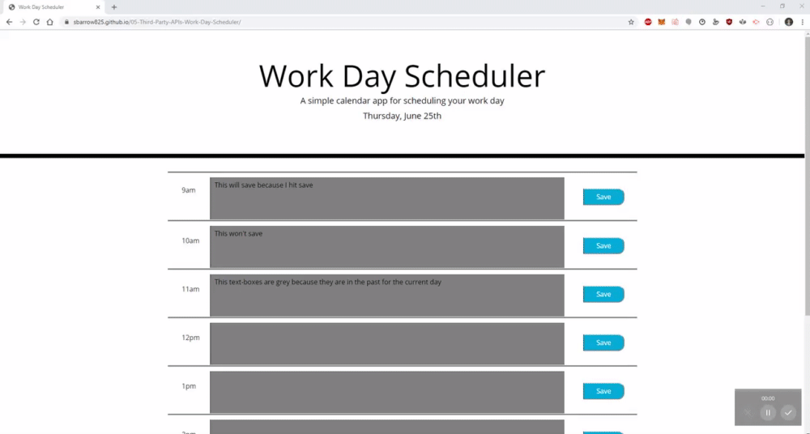

# CONTENTS OF THIS FILE
---------------------

## Introduction

 This repo contains the html, CSS, and JavaScript code for daily schedule planner web-application. The application allows the user to
 generate for themselves an hour-by-hour plan for their 9am-5pm work day. Each hour block of the day contains a text area for you to
 write you activities for that hour, as well as a save button next to that hour block to save your activity to local storage on your
 brower, meaning that if you close your browser and/or refresh the page, your activity for that hour will still be present. Hour blocks
 are also automatically updated with color coding. Hour blocks will either be grey, indicating that that hour block has passed, red,
 indicating that this is the current hour block, or green, indicating that this hour block is in the future. The current date is also
 displayed at the top of the page and automatically updated.

## Requirements

 In order to run the application for yourself, navigate to the interactive webpage found here: https://sbarrow825.github.io/05-Third-Party-APIs-Work-Day-Scheduler/
 Make sure to hit the save button to the right of the hour block after entering an activity if you want it to be saved to local storage on your browser.
 If you wish to delete an activity for a given hour, simply erase the text in that hour block and hit its respective save button.

The following gif demonstrates the application's functionality:

